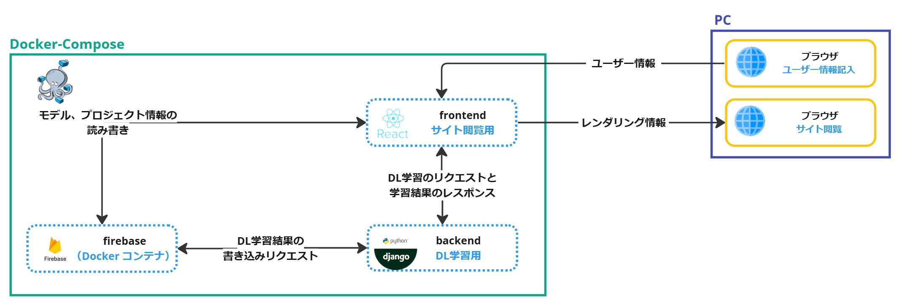

# DLab

# 目的

---

DLabの目的は、ノーコードで深層学習を可能にすることで、中高生を含むプログラミング経験のない人々が簡単にAIモデルの構築から学習までを体験できるようにすることである。DLabは、深層学習を学ぶ敷居を下げ、直感的に操作できるインターフェースを提供することで、AI技術へのアクセスを広げ、次世代のAIエンジニアの育成を支援することを目指している。また、実践的なAIプロジェクトに取り組むための知識を提供し、深層学習への興味と理解を深めることを期待している。

# 概要

---

https://github.com/user-attachments/assets/f4e3fa46-730b-4469-8d33-e17a93984962

DLabは主に「画像分類」と「強化学習」の二つの学習を提供している。それぞれの学習はプロジェクトで管理されており、プロジェクトはこちらで管理されている。プロジェクトの例として、画像分類では「MNIST」、強化学習では「CartPole」などが挙げられる。

プロジェクト内では、モデルの構築・学習・評価・管理を行うことができる。モデルの構築はGUI操作で行われ、ドラッグアンドドロップで層を移動させることやパラメータやハイパーパラメータの設定を柔軟に変更することができる。また、モデル作成日時、Accuracy、Lossでモデルを管理することで、昇順・降順並び替えや構築・学習したモデル同士の比較も可能である。更に、学習したモデルは重み(.pth)ファイルとしてダウンロードすることができ、重みを使用するためのPythonファイルもダウンロードすることができる。

モデルの構築・学習したものを客観的に比較するために、プロジェクト内にリーダーボードを設けている。そのため、構築・学習したモデルの精度の順位を知ることができ、深層学習を行う上で視野が広くなると考えている。

# 機能

---

[未記入]

# システム構成図

---

